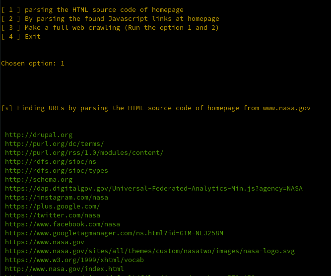
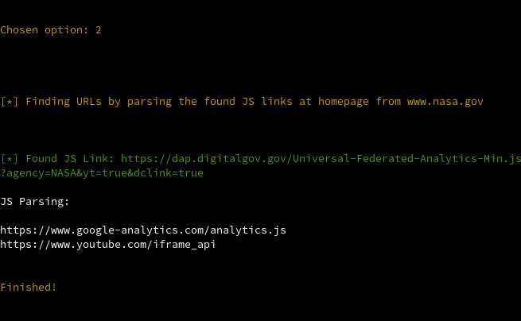

# BASHkrawler

## 1. Description

Bash web crawler for gathering URLs by matching a pattern word as optional argument and by html parsing in source code or / and by parsing the found JavaScript links at a target domain

## 2. Usage

<figure>
    
    <figcaption align = "center"><i><b>Fig.1  -  </b>Displaying banner</i></figcaption> 
</figure>

### 2.1. Making HTML parsing without using a pattern word to match

<figure>
    <figcaption align = "center"><i><b>Fig.2  -  </b>Chosing the option 1 to find all URLs at target domain www.nasa.gov via HTML parsing</i></figcaption> 
    <figcaption align = "center"><i><b>Fig.3  -  </b>Finding all URLs at target domain www.nasa.gov via HTML parsing</i></figcaption> 
</figure>

### 2.2. Finding all JS links at target domain and parsing them without using a pattern word to match

<figure>
    
    <figcaption align = "center"><i><b>Fig.4  -  </b>Chosing the option 2 to find all JS links at target domain www.nasa.gov and extract all URLs from this found JS links</i></figcaption> 
</figure>

### 2.3. Making a full web crawling by running the option 1 and 2 without using a pattern word to match

<figure>
    <figcaption align = "center"><i><b>Fig.5  -  </b>Chosing the option 3 to find all URLs at target domain www.nasa.gov via option 1 and 2 without using a pattern word to match</i></figcaption> 
    <figcaption align = "center"><i><b>Fig.6  -  </b>Finishing the full web crawling at target domain www.nasa.gov</i></figcaption> 
</figure>

### 2.4. Making HTML parsing by using a pattern word to match

<figure>
    <figcaption align = "center"><i><b>Fig.7  -  </b>Make web crawling at a target domain and find all URLs with the word ".nasa"</i></figcaption> 
    <figcaption align = "center"><i><b>Fig.8  -  </b>Chosing the option 3 to find all URLs with the word "nasa" at target domain www.nasa.gov via option 1 and 2</i></figcaption> 
    <figcaption align = "center"><i><b>Fig.9  -  </b>Finishing the full web crawling at target domain www.nasa.gov by using the word ".nasa"</i></figcaption> 
</figure>

## 3. References

<a>https://medium.com/netcoders/web-scraping-e-web-crawler-introdu%C3%A7%C3%A3o-e-passos-iniciais-8f846876292a</a> 
<a>https://medium.datadriveninvestor.com/what-is-a-web-crawler-and-how-does-it-work-b9e9c2e4c35d</a> 
