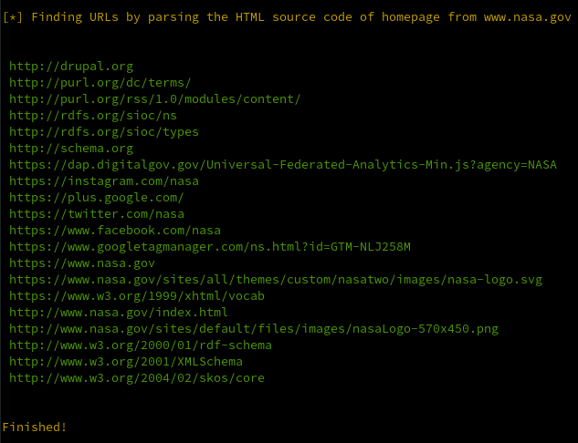
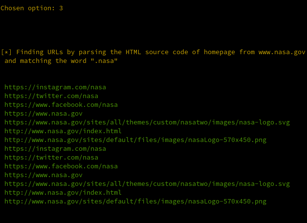

# BASHkrawler

## 1. Description

Bash Web Crawler to find URLs by parsing the HTML source code and the found javascript links on homepage of a required specific website domain. It is also possible to use a pattern word as optional argument to customize the URLs extraction.

<br/>

## 2. Install

```
➜ git clone https://github.com/torsh4rk/BASHkrawler.git
➜ cd BASHkrawler && chmod +x bashkrawler.sh
➜ ./bashkrawler.sh
```

## 3. Example Usage

<p align = "center">
    
    <i><b>Fig.1  -  </b>Displaying banner</i>
</p>

<br/>

### 3.1. Making HTML parsing without using a pattern word to match

<p align = "center">
    
    <i><b>Fig.2  -  </b>Chosing the option 1 to find all URLs at target domain <i>www.nasa.gov</i> via HTML parsing</i>
</p>

<p align = "center">
    
    <i><b>Fig.3  -  </b>Finding all URLs at target domain <i>www.nasa.gov</i> via HTML parsing</i>
</p>

<br/>

### 3.3. Finding all JS links at target domain and parsing them without using a pattern word to match

<p align = "center">
    
    <i><b>Fig.4  -  </b>Chosing the option 2 to find all JS links at target domain <i>www.nasa.gov</i> and extract all URLs from this found JS links</i>
</p>

<br/>

### 3.3. Making a full web crawling by running the option 1 and 2 without using a pattern word to match

<p align = "center">
    
    <i><b>Fig.5  -  </b>Chosing the option 3 to find all URLs at target domain <i>www.nasa.gov</i> via option 1 and 2 without using a pattern word to match</i>
</p>

<p align = "center">
    
    <i><b>Fig.6  -  </b>Finishing the full web crawling at target domain <i>www.nasa.gov</i></i>
</p>

<br/>

### 3.4. Making HTML parsing by using a pattern word to match

<p align = "center">
    
    <i><b>Fig.7  -  </b>Make web crawling at a target domain and find all URLs with the word ".nasa"</i>
</p>

<p align = "center">
    
    <i><b>Fig.8  -  </b>Chosing the option 3 to find all URLs with the word "nasa" at target domain <i>www.nasa.gov</i> via option 1 and 2</i>
</p>

<p align = "center">
    
    <i><b>Fig.9  -  </b>Finishing the full web crawling at target domain <i>www.nasa.gov</i> by using the word ".nasa"</i>
</p>

<br/>

## 4. References

<a>https://medium.datadriveninvestor.com/what-is-a-web-crawler-and-how-does-it-work-b9e9c2e4c35d</a><br/>
